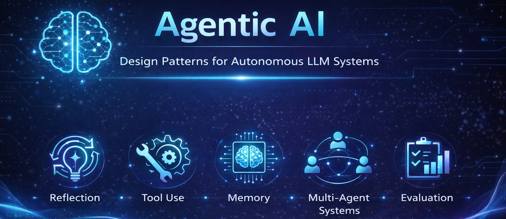

<p align="center">
  
</p>

# 🚀 Agentic AI - Design Patterns for Autonomous LLM Systems

A collection of **hands-on notebooks demonstrating the core architectural patterns behind modern agentic AI systems.**

This repository focuses on **how real LLM agents are structured**, including:

-   🔁 Reflection loops
-   🛠 Tool-using agents
-   🧠 Memory
-   🤝 Multi-agent systems
-   📊 Agent evaluation frameworks

Each notebook isolates **one key capability required to build reliable autonomous AI systems.**

------------------------------------------------------------------------

# 📚 Repository Overview

  ----------------------------------------------------------------------------------------------
| Concept | Description | Notebook |
|--------|-------------|----------|
| 🔁 **Reflection Pattern** | LLM generates a chart, critiques its own output, and improves the result through iterative feedback loops. | [reflection_chart_generation.ipynb](notebooks/reflection_chart_generation.ipynb) |
| 🛠 **Tool-Using Agent** | Demonstrates how LLM agents select and execute analytical tools to answer retail data questions. | [tool_use_retail_agent.ipynb](notebooks/tool_use_retail_agent.ipynb) |
| 🧠 **Agentic Memory** | A recommendation agent that stores and retrieves user preferences to improve responses over time. | [memory_movie_recommendation_agent.ipynb](notebooks/memory_movie_recommendation_agent.ipynb) |
| 🤝 **Multi-Agent Workflow** | Multiple specialized agents collaborate to perform bank marketing analysis and recommendations. | [bank_marketing_multi_agent_workflow.ipynb](notebooks/bank_marketing_multi_agent_workflow.ipynb) |
| 📊 **Agent Evaluation** | Framework for evaluating reasoning quality and reliability of a financial research agent. | [evals_financial_research_agent.ipynb](notebooks/evals_financial_research_agent.ipynb) |
  ----------------------------------------------------------------------------------------------

------------------------------------------------------------------------

# 🧠 Agent Architecture Patterns

Modern LLM agents rely on **structured reasoning workflows rather than
single prompts.**

A typical agent loop looks like this:

    User Query
        ↓
    Planner Agent
        ↓
    Tool Execution
        ↓
    Memory Retrieval
        ↓
    Reflection / Critique
        ↓
    Final Response

The notebooks in this repository demonstrate **different components of
this architecture.**

------------------------------------------------------------------------

# 🧩 Design Principles

The examples in this repository follow a few key principles:

### 1️⃣ Explicit Agent Control Loops

Agents are implemented using **clear reasoning workflows**, not hidden prompt chains.

### 2️⃣ Minimal but Realistic Implementations

Examples are simplified for learning while still reflecting **real AI system design patterns.**

### 3️⃣ Modular Responsibilities

Different components are separated:

-   reasoning
-   tool execution
-   memory
-   evaluation

### 4️⃣ Reproducible Workflows

Each notebook demonstrates **one standalone agent architecture pattern.**

------------------------------------------------------------------------

# ⚙️ Running the Notebooks

Clone the repository:

``` bash
git clone https://github.com/adarsh-aiml/agentic-ai.git
cd agentic-ai/notebooks
```

## Prerequisites

Create a `.env` file in the root of the repository with:

- `OPENAI_API_KEY`
- `TAVILY_API_KEY`

Install dependencies:

``` bash
pip install -r requirements.txt
```

Run the notebooks sequentially to observe **agent reasoning workflows in action.**

------------------------------------------------------------------------


# 👤 Author

**Adarsh Mishra**

Applied AI/ML practitioner exploring:

-   Agentic AI systems
-   LLM reasoning architectures
-   Applied AI workflows
-   ML System Design

------------------------------------------------------------------------

⭐ If you find this repository useful, consider **starring it.**
